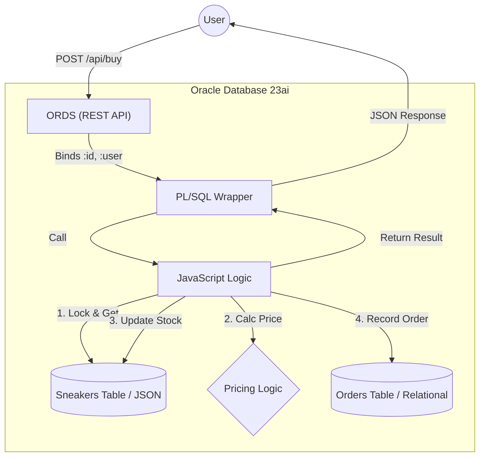

# SneakerHeadz Blitz (MLE Edition)

このプロジェクトは、**Oracle Database 23ai MLE (Multilingual Engine)** を活用し、JavaScriptとORDSを用いてデータベース内で完結する高性能なWebアプリケーションロジックを実装したサンプルです。

## アーキテクチャ解説

本アプリケーションは、**「在庫管理」における厳密な整合性** と **「Web API」としての使いやすさ** を両立するために、以下のハイブリッド構成を採用しています。

### 1. データフローとコンポーネント



### 2. 具体的なコードの振る舞い (購入処理の例)

ユーザーが `POST /api/buy` を叩いたとき、システム内部では以下のようにバトンが渡されます。

#### A. 入り口: ORDS (src/database/changelogs/50_ords.sql)
HTTPリクエストを受け取り、JSONボディの値（`id`, `size` 等）を自動的にバインド変数に変換して PL/SQL を呼び出します。
```sql
ORDS.DEFINE_SERVICE(
  p_pattern => 'buy',
  p_source  => 'BEGIN buy_kicks(:id, :size, :user, :premium, :status); END;'
);
```

#### B. 橋渡し: PL/SQL Wrapper (src/database/changelogs/30_wrappers.sql)
プロシージャ `buy_kicks` は、単なる「土管」として機能し、実際の処理をJavaScript関数 `purchase` へ委譲します。
```sql
-- JSの 'purchase' 関数へマッピング
SIGNATURE 'purchase(number, string, string, number)';
```

#### C. コアロジック: MLE JavaScript (src/database/changelogs/20_mle_wrapper.sql)
ここが心臓部です。GraalVM上で動作するJavaScriptが、データベースと直結してビジネスロジックを実行します。

1.  **行ロックによる同時実行制御**:
    ```javascript
    // SELECT ... FOR UPDATE で対象のスニーカー行をロック。
    // 他の人が同時に買おうとしても、この処理が終わるまで待たされます（在庫の矛盾を防ぐ）。
    const rows = session.execute(..., "SELECT data FROM sneakers ... FOR UPDATE", [id]);
    ```
2.  **インメモリでの在庫チェック & 減算**:
    ```javascript
    // DBから取得したJSONオブジェクトをメモリ上で操作
    if (snkData.sizes[size] <= 0) return { status: "FAIL", message: "Out of stock" };
    snkData.sizes[size] -= 1; // 在庫を減らす
    ```
3.  **データベースへの書き戻し**:
    ```javascript
    // 更新後のJSONをDBに保存
    session.execute("UPDATE sneakers SET data = :1 ...", [JSON.stringify(snkData), id]);
    // 注文履歴も同時に記録（同一トランザクション）
    session.execute("INSERT INTO orders ...", ...);
    ```

この一連の流れが **1つのデータベーストランザクション** として完結するため、ネットワーク遅延も発生せず、データの不整合も起きません。これが "SmartDB" アーキテクチャの強みです。

---

## 前提条件
- Oracle Database 23ai (Always Free, BaseDB, または ATP)
- `ADMIN` 権限を持つユーザー、もしくは `DB_DEVELOPER_ROLE` を持つユーザー
- Linux 環境 または GitHub Actions (CI/CD)
- **SQLcl** がインストールされていること

## ディレクトリ構成
```text
/
├── .github/workflows/   # GitHub Actions (CI/CD) 定義
├── db/                  # データベース定義 (Liquibase)
│   ├── controller.xml       # Root Changelog
│   └── changelogs/          # SQL Changelogs
├── scripts/             # NPM Build/Deploy Scripts
├── src/                 # アプリケーションロジック (JavaScript)
│   └── sneaker_logic.js
├── test/                # ユニットテスト (Vitest)
└── tools/               # 開発用・デバッグ用スクリプト
```

## デプロイ手順 (SQLcl & Liquibase)

本プロジェクトでは **Liquibase** を使用してデータベースの状態を管理します。
SQLcl がインストールされた環境であれば、以下のコマンド一発で最新の状態へ移行できます。

```bash
sql -S -cloudconfig Wallet_ODBGTEST001.zip admin/xxxx@ODBGTEST001_HIGH <<'SQL'
lb clear-checksums
lb update -changelog-file src/controller.xml
exit
SQL
```

このコマンドは `src/controller.xml` を読み込み、変更が必要な部分（差分）のみをデータベースに適用します。
JavaScriptロジックやPL/SQLを修正した場合は、自動的に再デプロイされます (`runOnChange:true` 設定済み)。

### GitHub Actions での実行
`.github/workflows/deploy.yml` はこの `script` コマンドを直接実行するように設定されています。
Githubの設定(Secrets)に `ORACLE_DB_CONNECTION` を追加してください。

## 動作確認 (Verification)

デプロイ完了後、以下の補助スクリプトを使って動作確認を行うことを推奨します。

### 1. テストデータの初期化
まず、テーブル（Sneakers/Orders）をクリーンアップし、初期データを投入します。

```bash
sql /nolog <<'EOF'
connect admin/password@service_name
@src/scripts/setup_data.sql
exit
EOF
```

### 2. APIテスト (CURL)
シェルスクリプト `test_api_curl.sh` を使用して、検索(GET)と購入(POST)をテストします。
引数には **ORDSのベースURL** を指定してください。

*   ORDSベースURLの例: `https://<hostname>/ords/<schema_alias>`
    *   `<schema_alias>` はデフォルトで `admin` ですが、設定によっては `sneakerheadz` 等になる場合があります。
    *   不明な場合は `src/scripts/debug_ords_status.sql` を実行して `PATTERN` を確認してください。

```bash
# 実行権限を付与
chmod +x src/scripts/test_api_curl.sh

# テスト実行 (URLは環境に合わせて変更してください)
./src/scripts/test_api_curl.sh https://phmoqknr.adb.ap-tokyo-1.oraclecloud.com/ords/admin
```
