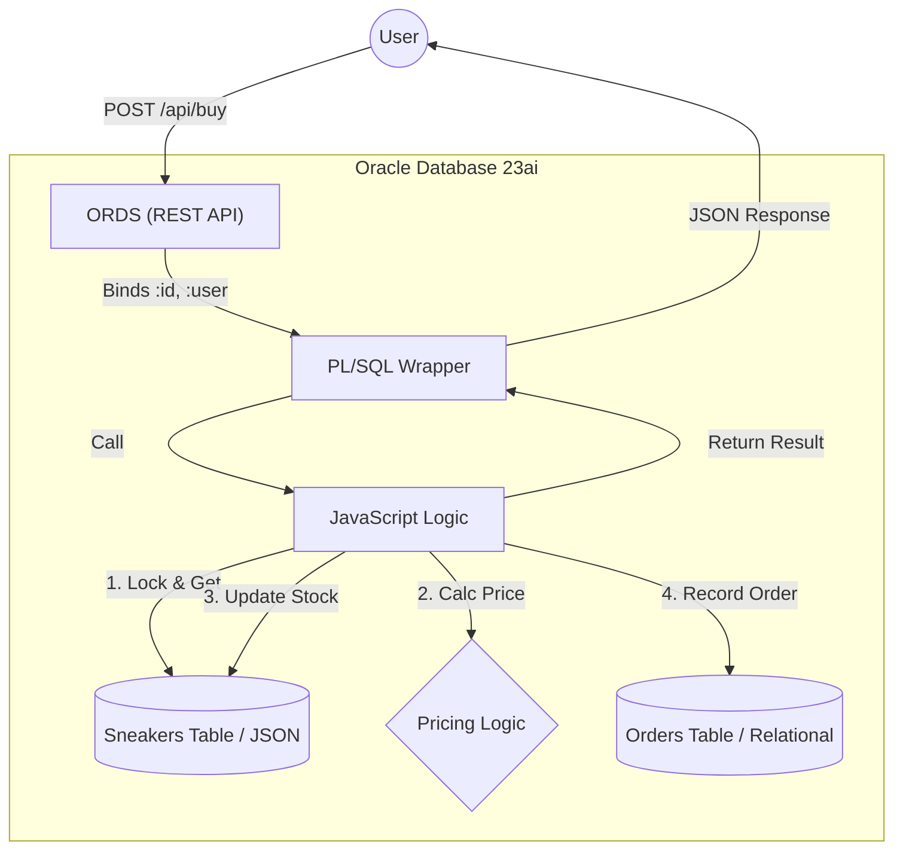

# SneakerHeadz Blitz (MLE Edition)

このプロジェクトは、**Oracle Database 23ai MLE (Multilingual Engine)** を活用し、JavaScriptとORDSを用いてデータベース内で完結する高性能なWebアプリケーションロジックを実装したサンプルです。

## アーキテクチャ解説

本アプリケーションは、**「在庫管理」における厳密な整合性** と **「Web API」としての使いやすさ** を両立するために、以下のハイブリッド構成を採用しています。

### 1. データフローとコンポーネント



### 2. 具体的なコードの振る舞い (購入処理の例)

ユーザーが `POST /api/buy` を叩いたとき、システム内部では以下のようにバトンが渡されます。

#### A. 入り口: ORDS (db/api/ords_definitions.sql)
HTTPリクエストを受け取り、JSONボディの値（`id`, `size` 等）を自動的にバインド変数に変換して PL/SQL を呼び出します。
```sql
ORDS.DEFINE_SERVICE(
  p_pattern => 'buy',
  p_source  => 'BEGIN buy_kicks(:id, :size, :user, :premium, :status); END;'
);
```

#### B. 橋渡し: PL/SQL Wrapper (db/logic/plsql_wrappers.sql)
プロシージャ `buy_kicks` は、単なる「土管」として機能し、実際の処理をJavaScript関数 `purchase` へ委譲します。
```sql
-- JSの 'purchase' 関数へマッピング
SIGNATURE 'purchase(number, string, string, number)';
```

#### C. コアロジック: MLE JavaScript (dist/db/logic/mle_module.sql)
ここが心臓部です。GraalVM上で動作するJavaScriptが、データベースと直結してビジネスロジックを実行します。

1.  **[New] Bot Protection (Anti-Resale)**:
    ```javascript
    // 同一ユーザーによる過去1分間の購入回数をチェック (One-Shotで完結)
    const count = session.execute("SELECT count(*) ... WHERE user_id = :1 AND ordered_at > SYSDATE - 1/1440", [userId]);
    if (count >= 3) return { status: "REJECTED", message: "Bot detected" };
    ```
2.  **行ロックによる同時実行制御**:
    ```javascript
    // SELECT ... FOR UPDATE で対象のスニーカー行をロック。
    // 他の人が同時に買おうとしても、この処理が終わるまで待たされます（在庫の矛盾を防ぐ）。
    const rows = session.execute(..., "SELECT data FROM sneakers ... FOR UPDATE", [id]);
    ```
3.  **インメモリでの在庫チェック & 減算**:
    ```javascript
    // DBから取得したJSONオブジェクトをメモリ上で操作
    if (snkData.sizes[size] <= 0) return { status: "FAIL", message: "Out of stock" };
    snkData.sizes[size] -= 1; // 在庫を減らす
    ```
4.  **データベースへの書き戻し**:
    ```javascript
    // 更新後のJSONをDBに保存
    session.execute("UPDATE sneakers SET data = :1 ...", [JSON.stringify(snkData), id]);
    // 注文履歴も同時に記録（同一トランザクション）
    session.execute("INSERT INTO orders ...", ...);
    ```

この一連の流れが **1つのデータベーストランザクション** として完結するため、ネットワーク遅延も発生せず、データの不整合も起きません。これが "SmartDB" アーキテクチャの強みです。

---

## 前提条件
- Oracle Database 23ai (Always Free, BaseDB, または ATP)
- `ADMIN` 権限を持つユーザー、もしくは `DB_DEVELOPER_ROLE` を持つユーザー
- Linux 環境 または GitHub Actions (CI/CD)
- **SQLcl** がインストールされていること

## ディレクトリ構成
```text
/
├── .github/workflows/   # GitHub Actions (CI/CD) 定義
├── db/                  # データベース定義 (Liquibase)
│   ├── controller.xml       # Root Changelog
│   ├── schema/           # 基本スキーマ (Table, Index)
│   ├── logic/            # ビジネスロジック (PL/SQL, MLE等)
│   └── api/              # API定義 (ORDS)
├── scripts/             # NPM Build/Deploy Scripts
├── src/                 # アプリケーションロジック (JavaScript)
│   └── sneaker_logic.js
├── test/                # ユニットテスト (Vitest)
└── tools/               # 開発用・デバッグ用スクリプト
```

## デプロイ手順 (NPM Workflow)

本プロジェクトでは、JavaScript のビルドと Liquibase によるデプロイを `npm` スクリプトで管理しています。

### 1. ビルド
`src/` 内の JavaScript ロジックを、データベースにデプロイ可能な SQL フォーマットに変換し、`dist/` ディレクトリに他の資材と共に集約します。

```bash
npm run build
```

### 2. テスト

テストは以下の様に実行します。`test:it`はTestContainerを利用してOracleにFunctionのデプロイをして動作確認をします。

```bash
npm run test:unit
npm run test:it
```

### 3. デプロイ

ビルド済みの資材を SQLcl (Liquibase) を通じてターゲットのデータベースに適用します。
引数として、ウォレットのパス（または `LOCAL`）と接続文字列を指定します。

```bash
# OCI ADB の場合 (Wallet 使用)
npm run deploy -- ./Wallet.zip admin/xxxx@adb_alias

# ローカル環境の場合 (コンテナ等)
npm run deploy -- LOCAL sneakerheadz/Welcome12345@localhost:1521/freepdb1
```

## GitHub Actions での実行
`.github/workflows/ci.yml` では、プルリクエストやコミット時に自動的に `npm run build` と `npm run test:it` が実行され、整合性がチェックされます。

## 動作確認 (Verification)

デプロイ完了後、以下の手順で動作確認を行います。

### 1. API テスト (CURL)
基本的な検索(GET)と購入(POST)をテストします。

```bash
# 実行 (URLは環境に合わせて変更してください)
bash -x tests/integration/test_api_curl.sh https://<hostname>/ords/admin
```

### 2. 負荷テスト (k6)
大規模なアクセス（"The Drop" シナリオ）をシミュレートします。

#### k6 のインストール (dnf)
Linux (Amazon Linux 2023, RHEL, Fedora 等) の場合は以下のコマンドでインストールできます。

```bash
# k6 のリポジトリを追加してインストール
sudo dnf install https://dl.k6.io/rpm/repo.rpm
sudo dnf install k6
```

#### テスト実行
環境変数 `BASE_URL` に ORDS のエンドポイントを指定して実行します。

```bash
# k6 ディレクトリに移動
cd k6

# 負荷テストの実行
k6 run -e BASE_URL=https://<hostname>/ords/admin load_test.js
```

このテストでは、最大 10,000 仮想ユーザーによる同時購入リクエストをシミュレーションし、`SPEC.md` で定義されたパフォーマンス目標（p95 < 100ms）を満たしているかを検証します。
